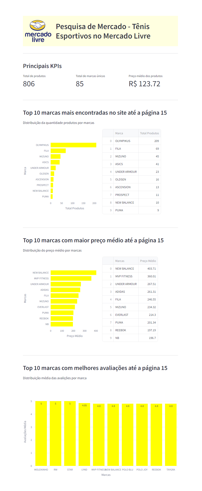

# Webscraping Monitoramento de Preços de Tênis Masculinos no Mercado Livre

## **Descrição**: 

Precisamos entender a relevância das marcas de tênis esportivos masculinos no Mercado Livre. O objetivo desta pesquisa é avaliar como as diversas marcas são percebidas pelos consumidores e gerar métricas que respondam às seguintes perguntas:

- Quais são as marcas mais frequentemente encontradas nas primeiras 15 páginas?
- Qual é o preço médio dos tênis esportivos por marca?
- Qual é o nível de satisfação dos consumidores em relação a cada marca?

## Etapas do Projeto:

### 1. Coleta dos Dados
- **Objetivo:** Extrair informações sobre tênis esportivos masculinos utilizando **Python** e o framework **Scrapy** para web scraping.

### 2. Tratamento dos Dados
- **Objetivo:** Transformar e limpar os dados coletados utilizando a biblioteca **Pandas** para processamento de dados.

### 3. Armazenamento dos Dados
- **Objetivo:** Armazenar os dados tratados de forma estruturada no banco de dados **SQLite3**.

### 4. Visualização dos Dados
- **Objetivo:** Desenvolver indicadores utilizando a biblioteca **Pandas** para criar as análises e o framework **Streamlit** para visualização dos dados.

## Arquitetura do Projeto

## Dashboard

